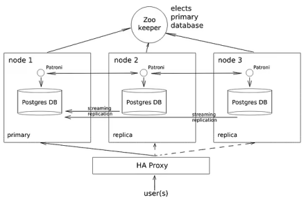

# ЛР 1. HA Postgres Cluster

## Задача

Развернуть и настроить высокодоступный кластер Postgres



## Ход работы

### Часть 1. Поднимаем Postgres

1. Подготавливаем Dockerfile для нашего постгреса. Кластеризацию будем делать с помощью [Patroni](https://github.com/patroni/patroni), а ему необходим доступ к бинарникам самого постгреса. Поэтому будем билдить образ, который сразу содержит в себе Postgres + Patroni

    Вот содержимое [Dockerfile](Dockerfile):
    ```Dockerfile
    FROM postgres:15
    
    # Ставим нужные для Patroni зависимости
    RUN apt-get update -y && \
        apt-get install -y netcat-openbsd python3-pip curl python3-psycopg2 python3-venv iputils-ping
    
    # Используем виртуальное окружение, доустанавливаем, собственно, Patroni
    RUN python3 -m venv /opt/patroni-venv && \
        /opt/patroni-venv/bin/pip install --upgrade pip && \
        /opt/patroni-venv/bin/pip install patroni[zookeeper] psycopg2-binary
    
    # Копируем конфигурацию для двух узлов кластера Patroni
    COPY postgres0.yml /postgres0.yml
    COPY postgres1.yml /postgres1.yml
    
    ENV PATH="/opt/patroni-venv/bin:$PATH"
    
    USER postgres
    
    # CMD не задаем, т.к. все равно будем переопределять его далее в compose
    ```

2. Подготавливаем compose файл, в котором описываем наш деплой постгреса. Так же добавляем в него [Zookepeer](https://zookeeper.apache.org/), который нужен для непосредственного управления репликацией и определением “лидера” кластера

    Вот содержимое [docker-compose.yml](docker-compose.yml):
    ```docker-compose.yml
    services:
      pg-master:
        build: .
        image: localhost/postres:patroni # имя для кастомного образа из Dockerfile, можно задать любое
        container_name: pg-master # Будущий адрес первой ноды
        restart: always
        hostname: pg-master
        environment:
          POSTGRES_USER: postgres
          POSTGRES_PASSWORD: postgres
          PGDATA: '/var/lib/postgresql/data/pgdata'
        expose:
          - 8008
        ports:
          - 5433:5432
        volumes:
          - pg-master:/var/lib/postgresql/data
        command: patroni /postgres0.yml
    
      pg-slave:
        build: .
        image: localhost/postres:patroni # имя для кастомного образа из Dockerfile, можно задать любое
        container_name: pg-slave # Будущий адрес второй ноды
        restart: always
        hostname: pg-slave
        expose:
          - 8008
        ports:
          - 5434:5432
        volumes:
          - pg-slave:/var/lib/postgresql/data
        environment:
          POSTGRES_USER: postgres
          POSTGRES_PASSWORD: postgres
          PGDATA: '/var/lib/postgresql/data/pgdata'
        command: patroni /postgres1.yml
    
      zoo:
        image: confluentinc/cp-zookeeper:7.7.1
        container_name: zoo # Будущий адрес зукипера
        restart: always
        hostname: zoo
        ports:
          - 2181:2181
        environment:
          ZOOKEEPER_CLIENT_PORT: 2181
          ZOOKEEPER_TICK_TIME: 2000
    
    volumes:
      pg-master:
      pg-slave:
    ```
3. Создаем упомянутые выше `postgres0.yml` и затем на основе него — `postgres1.yml` (надо будешь лишь поменять _имя, адреса и место хранения данных_ ноды с первой на вторую)

   Вот содержимое [postgres0.yml](postgres0.yml):
   
   ```yml
   scope: my_cluster # Имя нашего кластера
   name: postgresql0 # Имя первой ноды
   restapi: # Адреса первой ноды
     listen: pg-master:8008
     connect_address: pg-master:8008
   
   zookeeper:
     hosts:
     - zoo:2181 # Адрес Zookeeper
   
   bootstrap:
     dcs:
       ttl: 30
       loop_wait: 10
       retry_timeout: 10
       maximum_lag_on_failover: 10485760
       master_start_timeout: 300
       synchronous_mode: true
       postgresql:
         use_pg_rewind: true
         use_slots: true
         parameters:
           wal_level: replica
           hot_standby: "on"
           wal_keep_segments: 8
           max_wal_senders: 10
           max_replication_slots: 10
           wal_log_hints: "on"
           archive_mode: "always"
           archive_timeout: 1800s
           archive_command: mkdir -p /tmp/wal_archive && test ! -f /tmp/wal_archive/%f && cp %p /tmp/wal_archive/%f
   
     pg_hba:
     - host replication replicator 0.0.0.0/0 md5
       - host all all 0.0.0.0/0 md5
   
   postgresql:
     listen: 0.0.0.0:5432
     connect_address: pg-master:5432 # Адрес первой ноды
     data_dir: /var/lib/postgresql/data/postgresql0 # Место хранения данных первой ноды
     bin_dir: /usr/lib/postgresql/15/bin
     pgpass: /tmp/pgpass0
     authentication:
       replication: # логопасс для репликаци, при желании можно поменять
         username: replicator
         password: rep-pass
       superuser: # админский логопасс, при желании можно поменять (в том числе в файле compose)
         username: postgres
         password: postgres
     parameters:
       unix_socket_directories: '.'
   
   watchdog:
     mode: off
   
   tags:
     nofailover: false
     noloadbalance: false
     clonefrom: false
     nosync: false
   ```