# ЛР 1. HA Postgres Cluster

## Задача

Развернуть и настроить высокодоступный кластер Postgres


## Ход работы

### Часть 1. Поднимаем Postgres

1. Подготавливаем Dockerfile для нашего постгреса. Кластеризацию будем делать с помощью [Patroni](https://github.com/patroni/patroni), а ему необходим доступ к бинарникам самого постгреса. Поэтому будем билдить образ, который сразу содержит в себе Postgres + Patroni
   
   ####

   Вот содержимое [Dockerfile](Dockerfile):

   ```Dockerfile
   FROM postgres:15
   
   # Ставим нужные для Patroni зависимости
   RUN apt-get update -y && \
     apt-get install -y netcat-openbsd python3-pip curl python3-psycopg2 python3-venv iputils-ping
   
   # Используем виртуальное окружение, доустанавливаем, собственно, Patroni
   RUN python3 -m venv /opt/patroni-venv && \
     /opt/patroni-venv/bin/pip install --upgrade pip && \
     /opt/patroni-venv/bin/pip install patroni[zookeeper] psycopg2-binary
   
   # Копируем конфигурацию для двух узлов кластера Patroni
   COPY postgres0.yml /postgres0.yml
   COPY postgres1.yml /postgres1.yml
   
   ENV PATH="/opt/patroni-venv/bin:$PATH"
   
   USER postgres
   
   # CMD не задаем, т.к. все равно будем переопределять его далее в compose
   ```

2. Подготавливаем compose файл, в котором описываем наш деплой постгреса. Так же добавляем в него [Zookepeer](https://zookeeper.apache.org/), который нужен для непосредственного управления репликацией и определением “лидера” кластера
   
   ####

   Вот содержимое [docker-compose.yml](docker-compose.yml):

   ```yml
   services:
     pg-master:
       build: .
       image: localhost/postres:patroni # имя для кастомного образа из Dockerfile, можно задать любое
       container_name: pg-master # Будущий адрес первой ноды
       restart: always
       hostname: pg-master
       environment:
         POSTGRES_USER: postgres
         POSTGRES_PASSWORD: postgres
         PGDATA: '/var/lib/postgresql/data/pgdata'
       expose:
         - 8008
       ports:
         - 5433:5432
       volumes:
         - pg-master:/var/lib/postgresql/data
       command: patroni /postgres0.yml
   
     pg-slave:
       build: .
       image: localhost/postres:patroni # имя для кастомного образа из Dockerfile, можно задать любое
       container_name: pg-slave # Будущий адрес второй ноды
       restart: always
       hostname: pg-slave
       expose:
         - 8008
       ports:
         - 5434:5432
       volumes:
         - pg-slave:/var/lib/postgresql/data
       environment:
         POSTGRES_USER: postgres
         POSTGRES_PASSWORD: postgres
         PGDATA: '/var/lib/postgresql/data/pgdata'
       command: patroni /postgres1.yml
   
     zoo:
       image: confluentinc/cp-zookeeper:7.7.1
       container_name: zoo # Будущий адрес зукипера
       restart: always
       hostname: zoo
       ports:
         - 2181:2181
       environment:
         ZOOKEEPER_CLIENT_PORT: 2181
         ZOOKEEPER_TICK_TIME: 2000
   
   volumes:
     pg-master:
     pg-slave:
   ```

3. Создаем упомянутые выше `postgres0.yml` и затем на основе него — `postgres1.yml` (надо будешь лишь поменять _имя, адреса и место хранения данных_ ноды с первой на вторую)
   
   ####

   Вот содержимое [postgres0.yml](postgres0.yml):
   
   ```yml
   scope: my_cluster # Имя нашего кластера
   name: postgresql0 # Имя первой ноды
   
   restapi: # Адреса первой ноды
     listen: pg-master:8008
     connect_address: pg-master:8008
   
   zookeeper:
     hosts:
     - zoo:2181 # Адрес Zookeeper
   
   bootstrap:
     dcs:
       ttl: 30
       loop_wait: 10
       retry_timeout: 10
       maximum_lag_on_failover: 10485760
       master_start_timeout: 300
       synchronous_mode: true
       postgresql:
         use_pg_rewind: true
         use_slots: true
         parameters:
           wal_level: replica
           hot_standby: "on"
           wal_keep_segments: 8
           max_wal_senders: 10
           max_replication_slots: 10
           wal_log_hints: "on"
           archive_mode: "always"
           archive_timeout: 1800s
           archive_command: mkdir -p /tmp/wal_archive && test ! -f /tmp/wal_archive/%f && cp %p /tmp/wal_archive/%f
   
     pg_hba:
     - host replication replicator 0.0.0.0/0 md5
     - host all all 0.0.0.0/0 md5
   
   postgresql:
     listen: 0.0.0.0:5432
     connect_address: pg-master:5432 # Адрес первой ноды
     data_dir: /var/lib/postgresql/data/postgresql0 # Место хранения данных первой ноды
     bin_dir: /usr/lib/postgresql/15/bin
     pgpass: /tmp/pgpass0
     authentication:
       replication: # логопасс для репликаци, при желании можно поменять
         username: replicator
         password: rep-pass
       superuser: # админский логопасс, при желании можно поменять (в том числе в файле compose)
         username: postgres
         password: postgres
     parameters:
       unix_socket_directories: '.'
   
   watchdog:
     mode: off
   
   tags:
     nofailover: false
     noloadbalance: false
     clonefrom: false
     nosync: false
   ```
   
   Вот содержимое [postgres1.yml](postgres1.yml):
   
   ```yml
   scope: my_cluster # Имя нашего кластера
   name: postgresql1 # Имя второй ноды
   
   restapi: # Адреса второй ноды
     listen: pg-slave:8008
     connect_address: pg-slave:8008
   
   zookeeper:
     hosts:
     - zoo:2181 # Адрес Zookeeper
   
   bootstrap:
     dcs:
       ttl: 30
       loop_wait: 10
       retry_timeout: 10
       maximum_lag_on_failover: 10485760
       master_start_timeout: 300
       synchronous_mode: true
       postgresql:
         use_pg_rewind: true
         use_slots: true
         parameters:
           wal_level: replica
           hot_standby: "on"
           wal_keep_segments: 8
           max_wal_senders: 10
           max_replication_slots: 10
           wal_log_hints: "on"
           archive_mode: "always"
           archive_timeout: 1800s
           archive_command: mkdir -p /tmp/wal_archive && test ! -f /tmp/wal_archive/%f && cp %p /tmp/wal_archive/%f
   
     pg_hba:
     - host replication replicator 0.0.0.0/0 md5
     - host all all 0.0.0.0/0 md5
   
   postgresql:
     listen: 0.0.0.0:5432
     connect_address: pg-slave:5432 # Адрес второй ноды
     data_dir: /var/lib/postgresql/data/postgresql1 # Место хранения данных второй ноды
     bin_dir: /usr/lib/postgresql/15/bin
     pgpass: /tmp/pgpass1
     authentication:
       replication: # логопасс для репликаци, при желании можно поменять
         username: replicator
         password: rep-pass
       superuser: # админский логопасс, при желании можно поменять (в том числе в файле compose)
         username: postgres
         password: postgres
     parameters:
       unix_socket_directories: '.'
   
   watchdog:
     mode: off
   
   tags:
     nofailover: false
     noloadbalance: false
     clonefrom: false
     nosync: false
   ```

4. Деплоим. Проверяем в логах, что зукипер запустился, и что одна нода постгреса из двух стала лидером/овнером/мастером (**_есть вероятность, что вопреки названию это будет НЕ pg-master, это нормально!_**)
   
   ####

   Сначала собираем образ командой `docker-compose build` в папке проекта:

   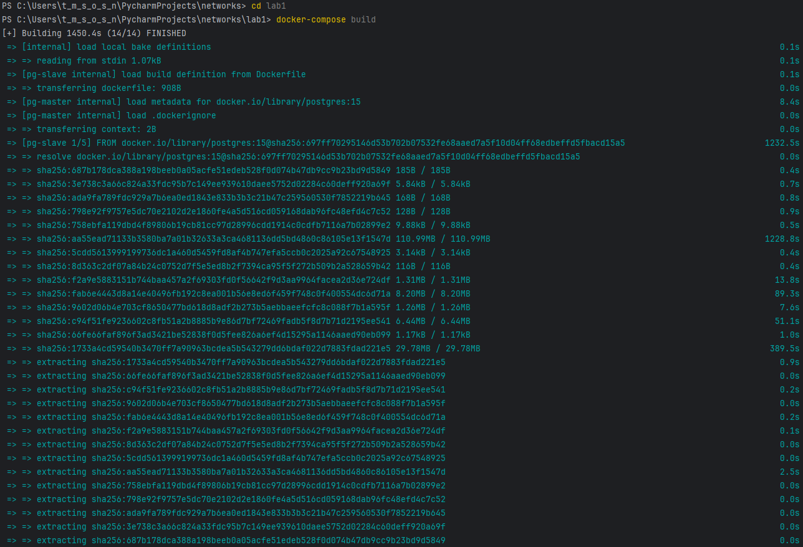
   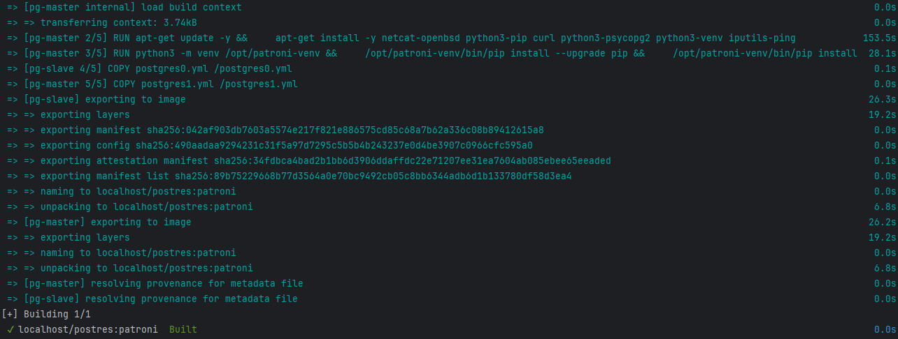
   
   Тут все круто. Дальше запускаем все сервисы командой `docker-compose up -d`:
   
   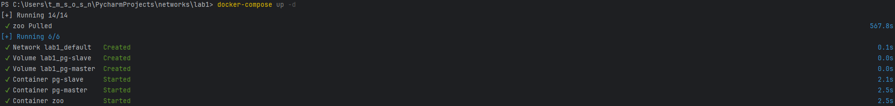

   Проверяем статус сервисов командой `docker-compose ps`:

   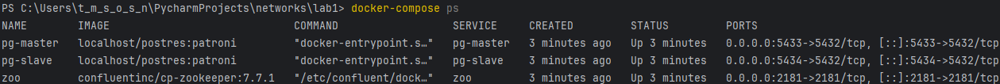

   Смотрим логи для проверки запуска:

   - проверяем зукипер командой `docker-compose logs zoo`,
   - проверяем мастер-ноду командой `docker-compose logs pg-master`,
   - проверяем реплику командой `docker-compose logs pg-slave`.

   Тут везде выдался огромный текст с логами, так что все хорошо (вставлять сюда не будем).

   У мастер-ноды выдалась вот такая строка:

   ```commandline
   pg-master  | 2025-12-27 13:11:47,152 INFO: no action. I am (postgresql0), the leader with the lock
   ```
   
   У реплики такая:

   ```commandline
   pg-slave  | 2025-12-27 13:12:37,109 INFO: no action. I am (postgresql1), a secondary, and following a leader (postgresql0)
   ```
   
   Ну тут все понятно, мастер - лидер, реплика - фолловер.

### Часть 2. Проверяем репликацию

1. Берем ЛЮБОЙ постгрес клиент (_голый psql, pgAdmin, DBeaver, …_) и подключаемся к обеим нодам постгреса:
   - dbname/username/password = `postgres` (либо свой вариант, если меняли в конфигах/композе)
   - host/port = `pg-master:5433` и `pg-slave:5434`
   
   ####

   Подключаемся к ноде-мастеру (порт 5433) командой `psql -h localhost -p 5433 -U postgres -d postgres` (вводим пароль `postgres`):

   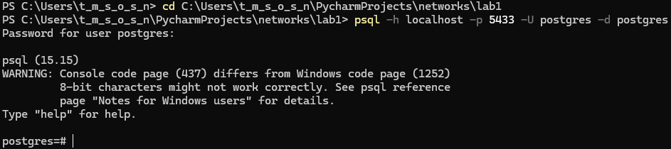

   Аналогично подключаемся к ноде-реплике (порт 5434):

   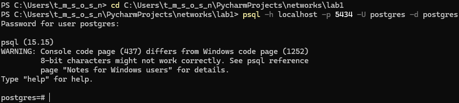

2. Из двух подключений выбираем **pg-master** (**_только если, оно является Лидером этого кластера_**). Создаем таблицу с ЛЮБОЙ структурой и записываем в нее ЛЮБЫЕ данные
   
   ####

   Проверяем роль сервера в каждом подключении командой `SELECT pg_is_in_recovery();`:

   Мастер-нода:

   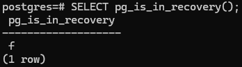

   Значит, эта нода действительно является мастером и может принимать запись.

   Реплика:

   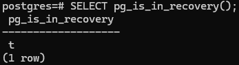

   Значит, этот сервер действительно является репликой и работает в режиме только для чтения.

   Создадим таблицу в мастер-ноде и вставим в нее данные с помощью таких команд:

   ```sql
   CREATE TABLE test_replication (id SERIAL PRIMARY KEY, data TEXT, created_at TIMESTAMP DEFAULT NOW());
   INSERT INTO test_replication (data) VALUES ('Данные с мастера');
   ```

   Все создалось на мастер-ноде:

   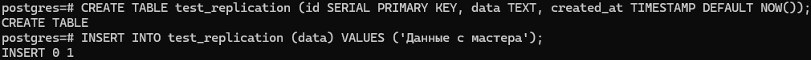

   Проверяем репликации на реплике:

3. Заходим в подключение **pg-slave** и наблюдаем магию: во второй базе данных автоматически создалась такая же таблица с такими же данными
   
   ####

   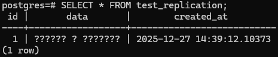

   Да, мы не догадались латиницей записывать, но ничего страшного - все равно видно, что репликация работает.

4. В подключении **pg-slave** пробуем провести какую-нибудь операцию на редактирование. Например, попытаемся вставить новые данные в таблицу, или вовсе удалить ее. Получим отказ, т.к. эта нода работает в режиме _slave/readonly_
   
   ####

   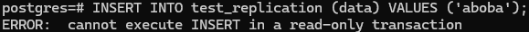

   Вы не обманули, спасибо!

### Часть 3. Делаем ~~среднего роста~~ высокую доступность

1. Для балансировки трафика нам нужен специальное ПО, собственно балансировщик. Например, [HAProxy](https://www.haproxy.org/) — добавляем его в `docker-compose.yml`:

   ```yml
   haproxy:
     image: haproxy:3.0
     container_name: postgres_entrypoint # Это будет адрес подключения к БД, можно выбрать любой
     ports:
       - 5432:5432 # Это будет порт подключения к БД, можно выбрать любой
       - 7000:7000
     depends_on: # Не забываем убедиться, что сначала все корректно поднялось
       - pg-master
       - pg-slave
       - zoo
     volumes:
       - ./haproxy.cfg:/usr/local/etc/haproxy/haproxy.cfg
   ```
   
   ####

   В раздел `services` ам нужно добавить этот кусочек кода.

2. Не забываем создать упомянутый выше `haproxy.cfg` со следующим содержимым:

   ```cfg
   global
       maxconn 100

   defaults
       log global
       mode tcp
       retries 3
       timeout client 30m
       timeout connect 4s
       timeout server 30m
       timeout check 5s
   
   listen stats
       mode http
       bind *:7000
       stats enable
       stats uri /
   
   listen postgres
       bind *:5432 # Выбранный порт из docker-compose.yml
       option httpchk
       http-check expect status 200 # Описываем нашу проверку доступности (в данном случае обычный HTTP-пинг)
       default-server inter 3s fall 3 rise 2 on-marked-down shutdown-sessions
       server postgresql_pg_master_5432 pg-master:5432 maxconn 100 check port 8008 # Адрес первой ноды постгреса
       server postgresql_pg_slave_5432 pg-slave:5432 maxconn 100 check port 8008 # Адрес второй ноды постгреса
   ```