# ЛР 2. Loki + Zabbix + Grafana

## Задача

Подключить к тестовому сервису Nextcloud мониторинг + логирование. Осуществить визуализацию через Grafana

## Ход работы

### Часть 1. Логирование

1. Создать файл `docker-compose.yml`, который содержит в себе тестовый сервис Nextcloud, Loki, Promtail, Grafana, Zabbix и Postgres для него

   ####

   Вот содержимое [docker-compose.yml](docker-compose.yml):

   ```yml
   services:
     nextcloud:
       image: nextcloud:29.0.6
       container_name: nextcloud # на это имя будет завязана настройка забикса далее, так что лучше не менять
       ports:
         - "8080:80"
       volumes:
         - nc-data:/var/www/html/data
   
     loki: # сервис-обработчик логов
       image: grafana/loki:2.9.0
       container_name: loki
       ports:
         - "3100:3100"
       command: -config.file=/etc/loki/local-config.yaml # запуск с дефолтным конфигом
     
     promtail: # сервис-сборщик логов
       image: grafana/promtail:2.9.0
       container_name: promtail
       volumes:
         - nc-data:/opt/nc_data # та же самая директория, которая монтируется в Nextcloud
         - ./promtail_config.yml:/etc/promtail/config.yml
       command: -config.file=/etc/promtail/config.yml
     
     grafana: # сервис визуализации
       environment:
         - GF_PATHS_PROVISIONING=/etc/grafana/provisioning # просто
         - GF_AUTH_ANONYMOUS_ENABLED=true # дефолтные
         - GF_AUTH_ANONYMOUS_ORG_ROLE=Admin # настройки
       command: /run.sh
       image: grafana/grafana:11.2.0
       container_name: grafana
       ports:
         - "3000:3000"
     
     postgres-zabbix:
       image: postgres:15
       container_name: postgres-zabbix
       environment:
         POSTGRES_USER: zabbix
         POSTGRES_PASSWORD: zabbix
         POSTGRES_DB: zabbix
       volumes:
         - zabbix-db:/var/lib/postgresql/data
       healthcheck:
         test: ["CMD", "pg_isready", "-U", "zabbix"]
         interval: 10s
         retries: 5
         start_period: 5s
     
     zabbix-server:
       image: zabbix/zabbix-server-pgsql:ubuntu-6.4-latest # непосредственно бэкенд забикса
       container_name: zabbix-back
       ports:
         - "10051:10051"
       depends_on:
         - postgres-zabbix
       environment:
         POSTGRES_USER: zabbix
         POSTGRES_PASSWORD: zabbix
         POSTGRES_DB: zabbix
         DB_SERVER_HOST: postgres-zabbix
     
     zabbix-web-nginx-pgsql:
       image: zabbix/zabbix-web-nginx-pgsql:ubuntu-6.4-latest # фронтенд забикса
       container_name: zabbix-front
       ports:
         - "8082:8080" # внешний порт можно любой по своему желанию
       depends_on:
         - postgres-zabbix
       environment:
         POSTGRES_USER: zabbix
         POSTGRES_PASSWORD: zabbix
         POSTGRES_DB: zabbix
         DB_SERVER_HOST: postgres-zabbix
         ZBX_SERVER_HOST: zabbix-back
   
   volumes:
     nc-data:
     zabbix-db:
   ```
   
2. Создать файл `promtail_config.yml` (или любое другое имя, главное чтоб совпадало с прописанным в композе) со следующим содержанием:

   ```yml
   server:
     http_listen_port: 9080
     grpc_listen_port: 0
   
   positions:
     filename: /tmp/positions.yaml
   
   clients:
     - url: http://loki:3100/loki/api/v1/push # адрес Loki, куда будут слаться логи
   
   scrape_configs:
   - job_name: system # любое имя
     static_configs:
     - targets:
       - localhost # т.к. монтируем папку с логами прямо в контейнер Loki, он собирает логи со своей локальной файловой системы
       labels:
         job: nextcloud_logs # любое имя, по этому полю будет осуществляться индексирование
         __path__: /opt/nc_data/*.log # необязательно указывать полный путь, главное сказать где искать log файлы
   ```

3. Запустить compose файл, проверить что все “взлетело”

   ####

   В папке с проектом запускаем команды `docker-compose build` (сборка образа) и `docker-compose up -d` (запуск всех сервисов):

   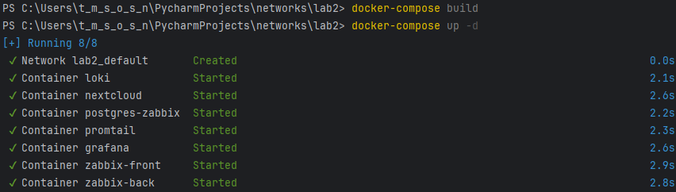

   На самом деле это получилось далеко не с первого раза, потому что все время кидались ошибки по типу такой:

   ```
   failed to copy: httpReadSeeker: failed open: failed to do request: Get "https://registry-1.docker.io/v2/grafana/loki/blobs/sha256:4afc9154faa4c90aed0a97e33cb95572352315c0760d60d06813d2b406c94f15": net/http: TLS handshake timeout
   ```

   Но мы смогли!

   Теперь командой `docker-compose ps` проверим, что все контейнеры запустились:

   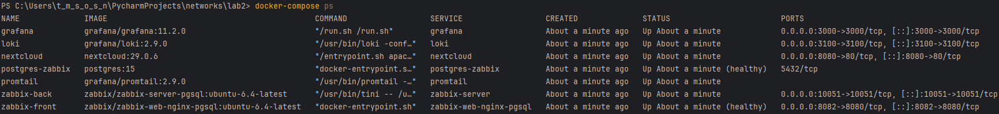

4. Для начала инициализируем Nextcloud. Для этого заходим на веб интерфейс через внешний порт, указанный в compose файле, создаем учетку и проверяем, что логи “пошли” в нужный нам файл /var/www/html/data/nextcloud.log

   ####

   Заходим на http://localhost:8080/, нас встречает вот такое чудо:

   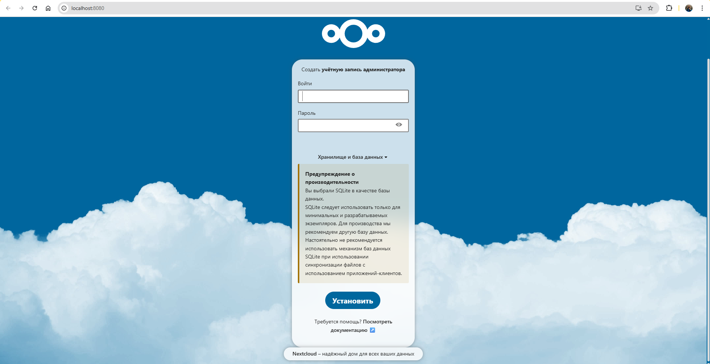

   Затем  

   Далее запускаем команду `docker exec nextcloud tail -f /var/www/html/data/nextcloud.log`, чтобы убедиться, что все логи лежат там, где нужно:

   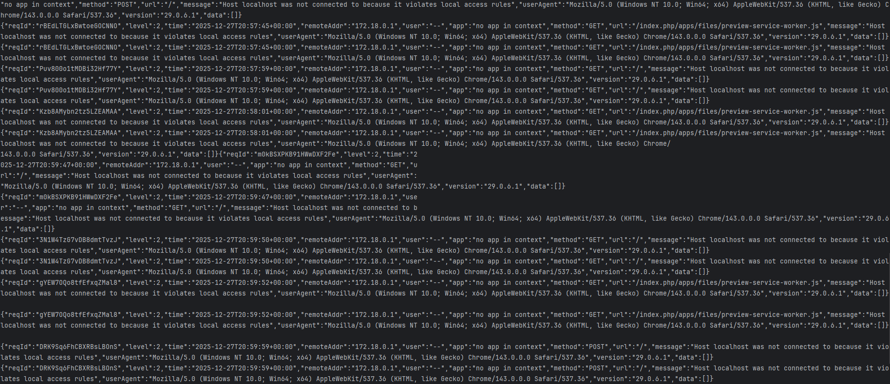

   Все ок, логи идут!

5. После инициализации Nextcloud проверяем в логах promtail, что он “подцепил” нужный нам log-файл: должны быть строчки, содержащие `msg=Seeked /opt/nc_data/nextcloud.log`

   ####

   Будем искать логи с помощью команды `docker logs promtail`:

   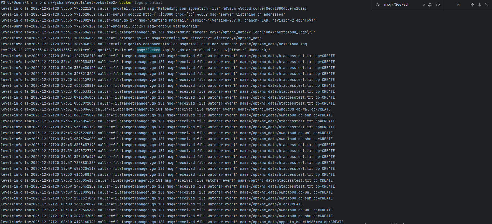

### Часть 2. Мониторинг

1. Теперь настраиваем Zabbix. Подключаемся к веб-интерфейсу ( `http://localhost:8082` или свой выбранный порт из композ файла) , креды `Admin` | `zabbix`

   ####

   Открылась такая страница:

   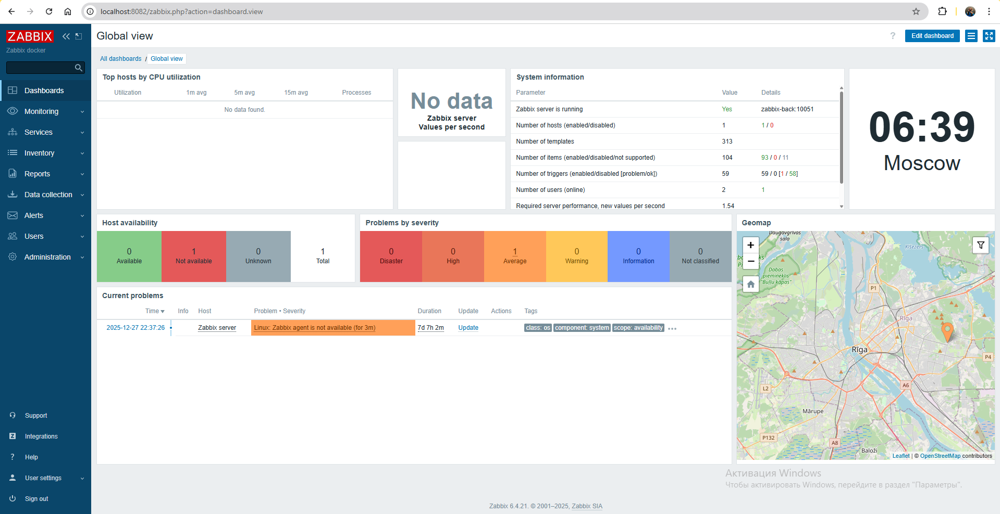

2. В разделе _Data collection_ → _Templates_ делаем _Import_ кастомного шаблона (темплейта) для мониторинга nextcloud. Для импорта нужно предварительно создать yaml-файл со следующим содержанием:

   ```yml
   zabbix_export:
     version: '6.4'
     template_groups:
       - uuid: a571c0d144b14fd4a87a9d9b2aa9fcd6
         name: Templates/Applications
     templates:
       - uuid: a615dc391a474a9fb24bee9f0ae57e9e
         template: 'Test ping template'
         name: 'Test ping template'
         groups:
           - name: Templates/Applications
         items:
           - uuid: a987740f59d54b57a9201f2bc2dae8dc
             name: 'Nextcloud: ping service'
             type: HTTP_AGENT
             key: nextcloud.ping
             value_type: TEXT
             trends: '0'
             preprocessing:
               - type: JSONPATH
                 parameters:
                   - $.body.maintenance
               - type: STR_REPLACE
                 parameters:
                   - 'false'
                   - healthy
               - type: STR_REPLACE
                 parameters:
                   - 'true'
                   - unhealthy
             url: 'http://{HOST.HOST}/status.php'
             output_format: JSON
             triggers:
               - uuid: a904f3e66ca042a3a455bcf1c2fc5c8e
                 expression: 'last(/Test ping template/nextcloud.ping)="unhealthy"'
                 recovery_mode: RECOVERY_EXPRESSION
                 recovery_expression: 'last(/Test ping template/nextcloud.ping)="healthy"'
                 name: 'Nextcloud is in maintenance mode'
                 priority: DISASTER
   ```

   ####

   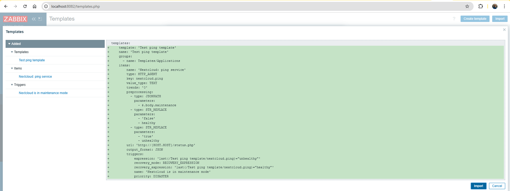

3. Чтобы Zabbix и Nextcloud могли общаться по своим коротким именам внутри докеровской сети, в некстклауде необходимо “разрешить” это имя. Для этого нужно зайти на контейнер некстклауда под юзером `www-data` и выполнить команду `php occ config:system:set trusted_domains 1 --value="nextcloud"`

   ####

   Нужно выполнить такую команду: `docker exec -it nextcloud su -s /bin/sh www-data -c "php occ config:system:set trusted_domains 1 --value='nextcloud'"`.

   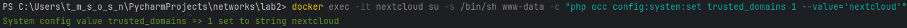

4. В разделе _Data collection_ → _Hosts_ делаем (_Create host_). Указываем адрес (имя) контейнера nextcloud, видимое имя - любое, хост группа - _Applications_ (но в целом можно любую другую). Чтобы не просто добавить хост, а начать его мониторинг, необходимо подключить к нему нужный шаблон мониторинга. Поэтому в поле _Templates_ нужно выбрать добавленный на шаге 2 _Templates/Applications_→ _Test ping template_

   ####

   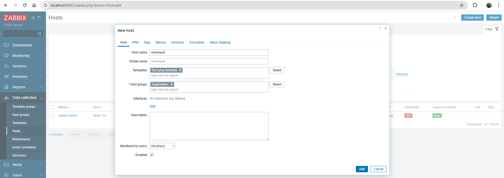

   Дальше нажимаем **Add**.

5. Настройка хоста закончена, можно сохранить и перейти в раздел _Monitoring_ → _Latest data_. Через какое-то время там должны появиться первые данные, в нашем случае значение healthy

   ####

   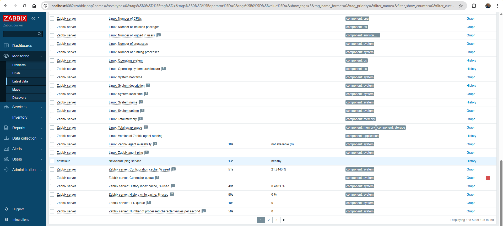

6. На этом мониторинг можно считать успешно настроенным. При желании можно временно включить в некстклауде _maintenance mode_ ( `php occ maintenance:mode --on` в контейнере), проверить что сработал триггер (раздел _Monitoring_ → _Problems_), выключить режим обратно ( `php occ maintenance:mode --off` ), убедиться что проблема помечена как “решенная”

### Часть 3. Визуализация

1. В терминале выполнить команду `docker exec -it grafana bash -c "grafana cli plugins install alexanderzobnin-zabbix-app"` , затем `docker restart grafana`

    ####

   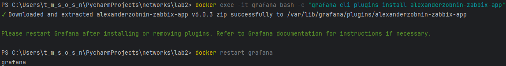

2. Заходим в графану (по умолчанию `http://localhost:3000/` ), раздел Administration → Plugins. Найти там Zabbix, активировать (_Enable_)

   ####

   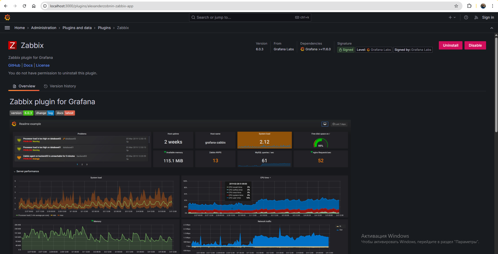

3. Подключаем Loki к Grafana, раздел _Connections_ → _Data sources_ → _Loki_. В настройках подключения указать любое имя и адрес `http://loki:3100` , все остальное можно оставить по дефолту:

   ####

   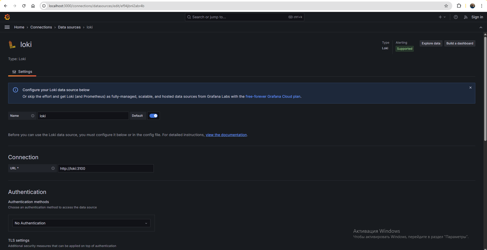

4. Сохранить подключение, нажав _Save & Test_. Если нет ошибок и сервис предлагает перейти к визуализации и/или просмотру данных, значит в Части 1 все настроено правильно

   ####

   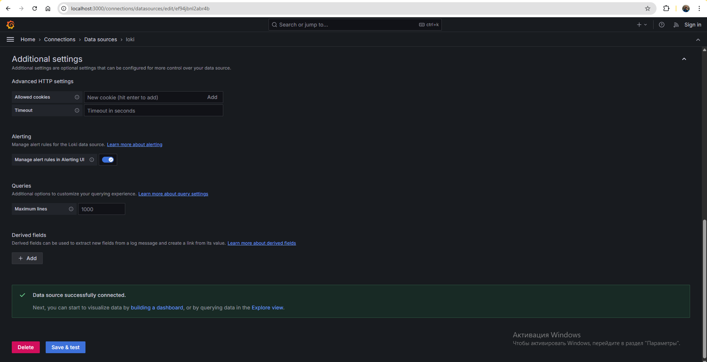

   Получается, в части 1 все нстроено правильно!

5. Точно так же с забиксом: снова подключаем новый датасурс, в этот раз Zabbix. В качестве _URL_ указываем `http://zabbix-front:8080/api_jsonrpc.php` , заполняем _Username_ и _Password_, через _Save & test_ проверяем, что подключение успешно

   ####

   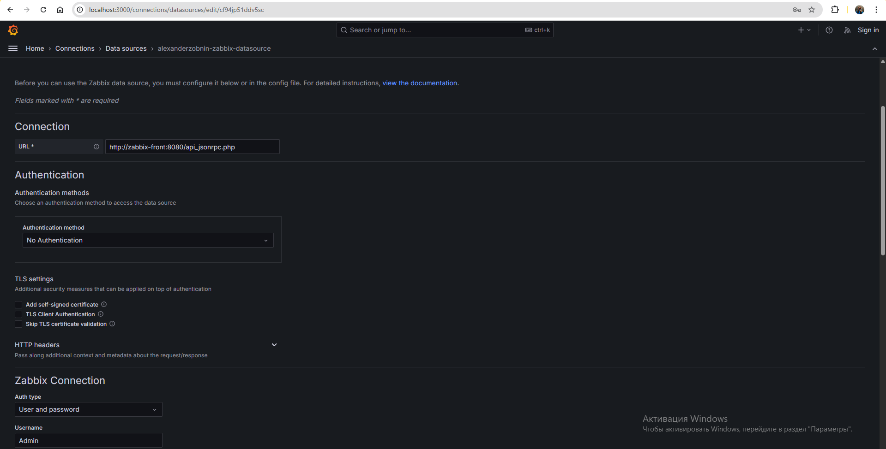

   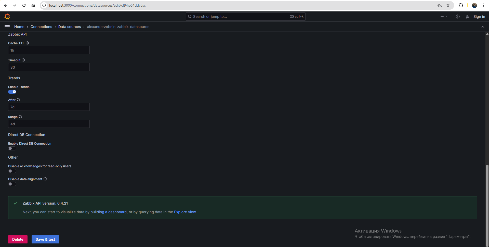

6. Собственно, можно перейти в _Explore_ (на этой же странице или через общее меню), выбрать в качестве селектора (индекса) `job` либо `filename` - если все было правильно настроено, то нужные значения будут в выпадающем списке. Затем нажать _Run query_ и увидеть свои логи (но это неточно)

   ####

   Значения дейтствительно есть в выпадающем списке:

   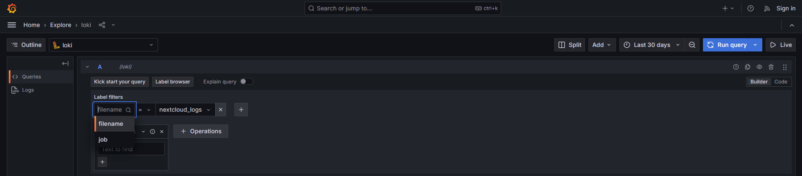

   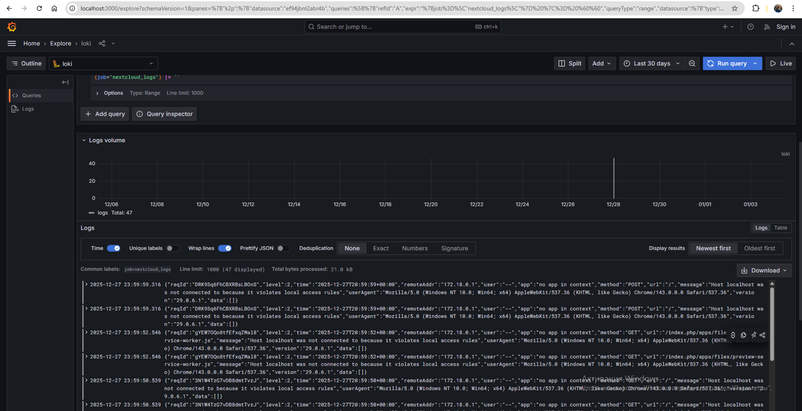

   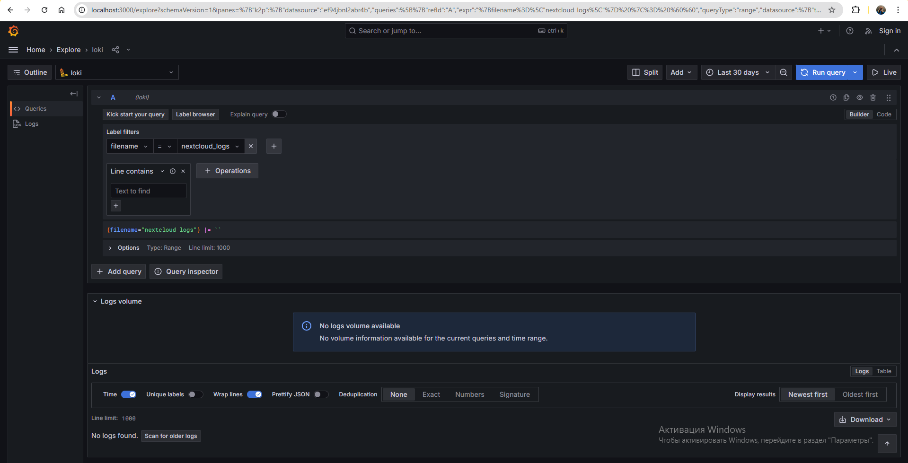

7. То же самое с забиксом, при выставлении всех фильтров:

   ####

   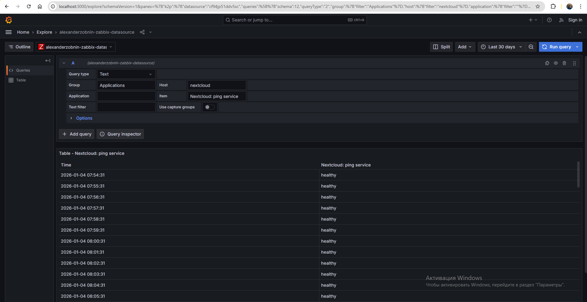

## Задание
1. “Поиграться” с запросами

   ####

   Получается, я поигрался с запросами в п. 6-7 части 3)

2. Создать два простеньких дашборда в Grafana с использованием датасурсов Zabbix (цветная плашка) и Loki (таблица с логами).

   ####

   Создадим визуализацию по Zabbix со следующими настройками:

   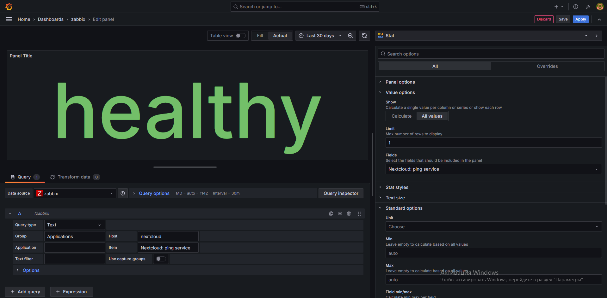

   Визуализация по Loki будет с такими настройками:

   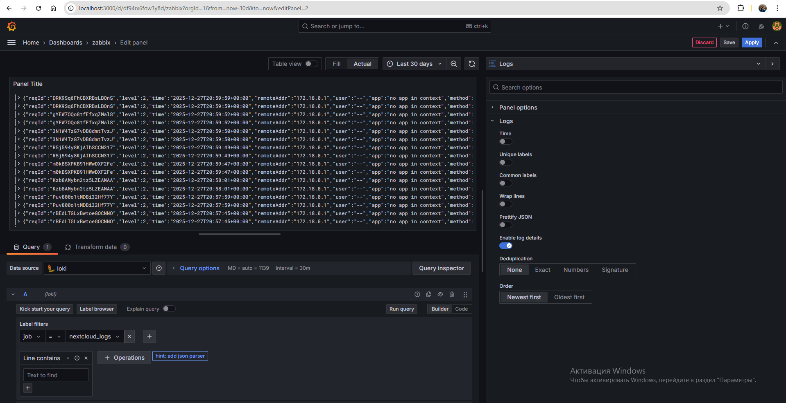

   Итоговый дашборд:

   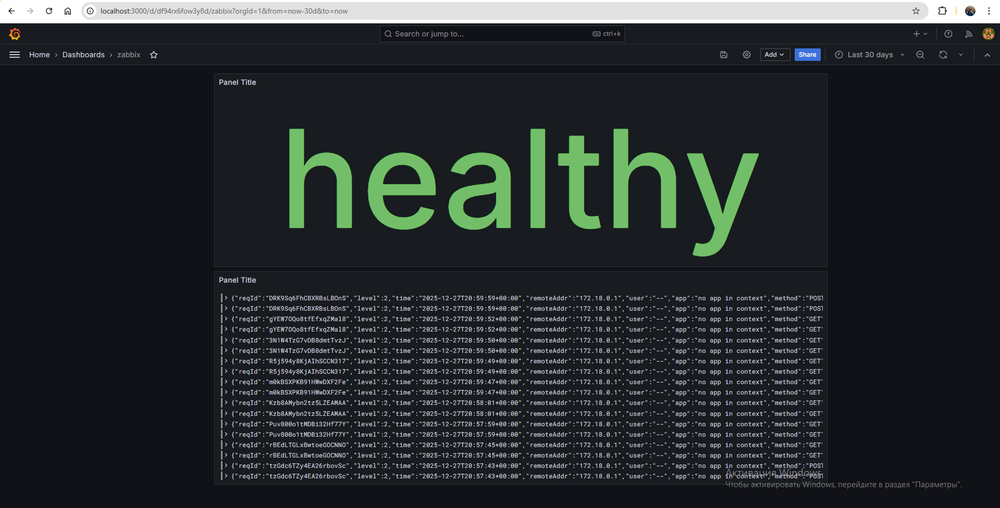

## Вопросы

1. Чем SLO отличается от SLA?

   ####

   **SLA (Service Level Agreement, Соглашение об уровне сервиса)** - это формальный договор с пользователем или клиентом. В нем зафиксированы конкретные гарантии, например, "доступность 99.9% ежемесячно", а также последствия (часто финансовые) в случае их невыполнения.

   **SLO (Service Level Objective, Цель уровня сервиса)** - это внутренняя целевая метрика, которую устанавливает для себя команда эксплуатации. Она обычно строже, чем условия SLA, и служит для создания надежного "буфера" и фокусировки на качестве работы системы.

2. Чем отличается инкрементальный бэкап от дифференциального?

   ####

   Оба метода экономят место, но принцип работы у них разный.

   - **Дифференциальный бэкап** сохраняет все изменения, произошедшие **с момента последнего полного копирования**. Каждая новая копия становится больше, но для восстановления системы нужны только последний полный и последний дифференциальный бэкап.
   - **Инкрементальный бэкап** сохраняет только те данные, которые изменились **с момента любого предыдущего бэкапа** (полного или инкрементального). Каждая копия минимальна по размеру, но для восстановления требуется цепочка из полного бэкапа и всех последующих инкрементальных.

3. В чем разница между мониторингом и observability?

   ####

   **Мониторинг** - это процесс отслеживания системы по заранее определенным метрикам (загрузка CPU, частота ошибок) для быстрого обнаружения сбоев и отклонений.

   **Observability (Наблюдаемость)** - это характеристика системы, которая позволяет исследовать ее внутреннее состояние по внешним данным (логи, метрики, трассировки), даже когда сценарий сбоя неизвестен заранее.