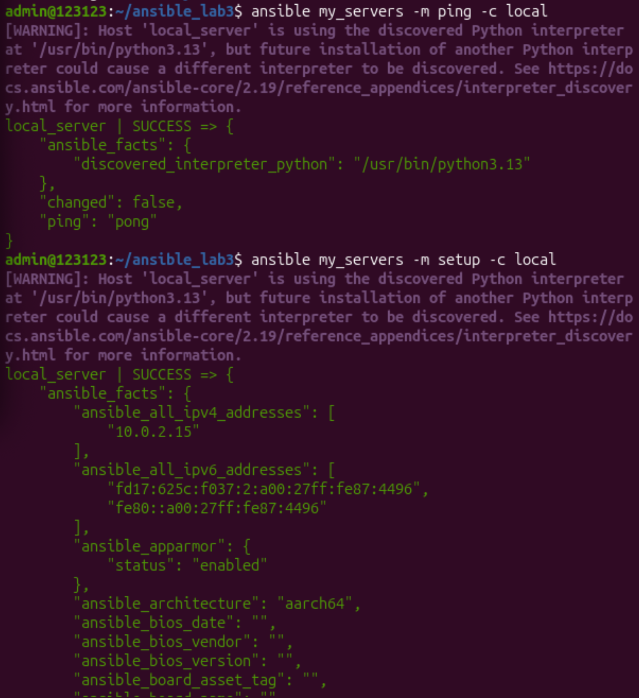
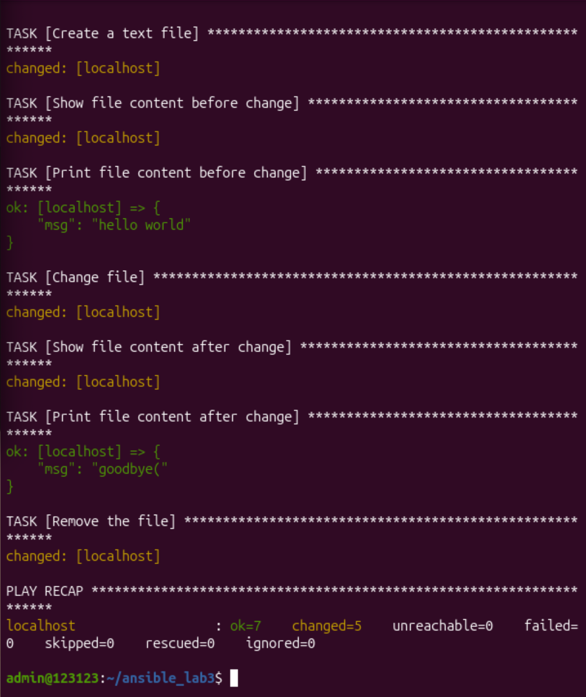
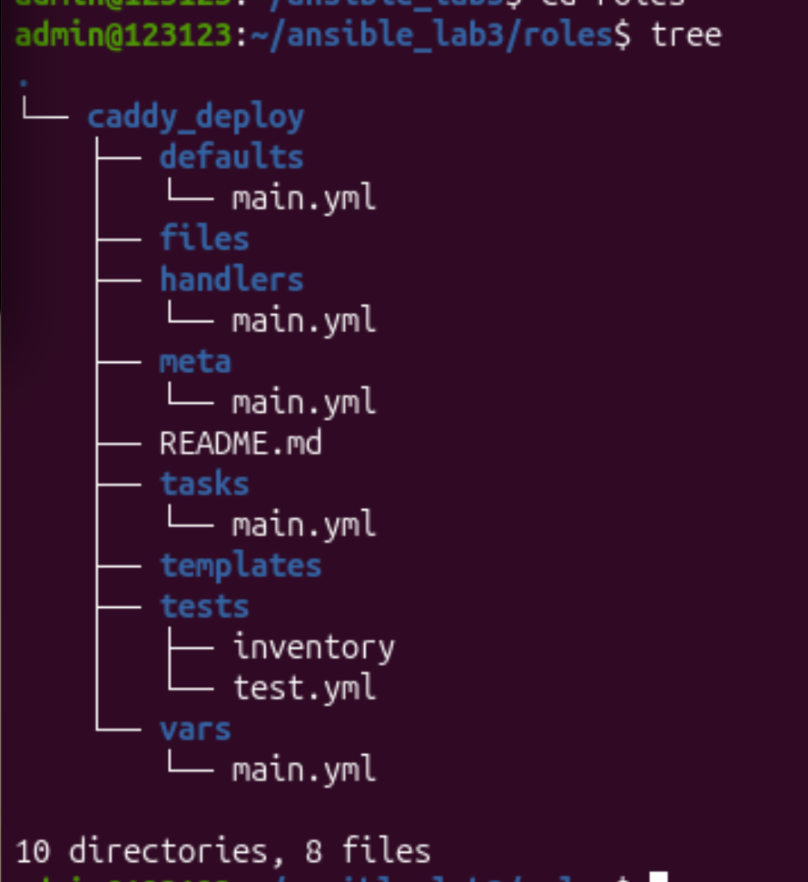
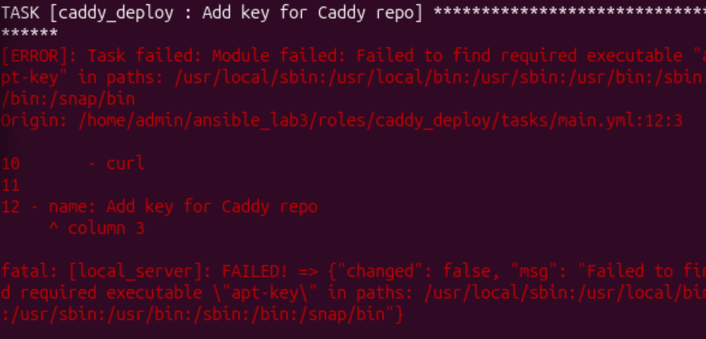
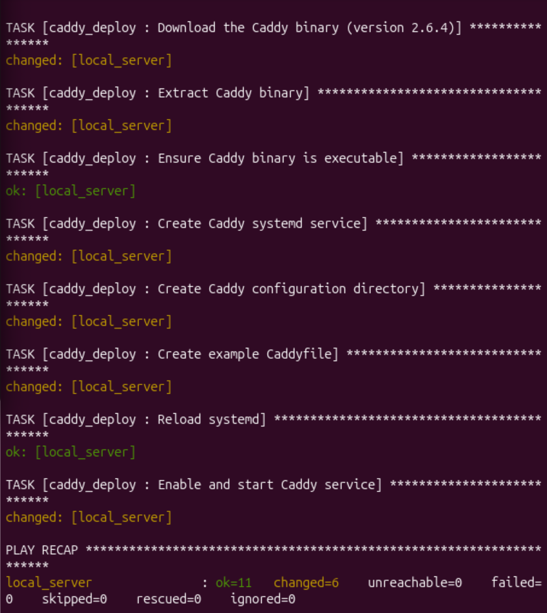
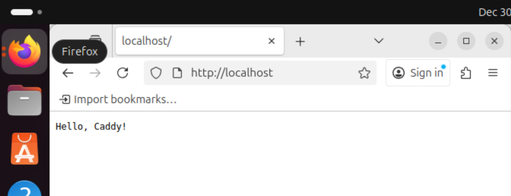
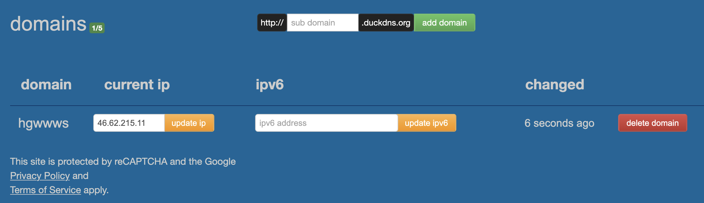
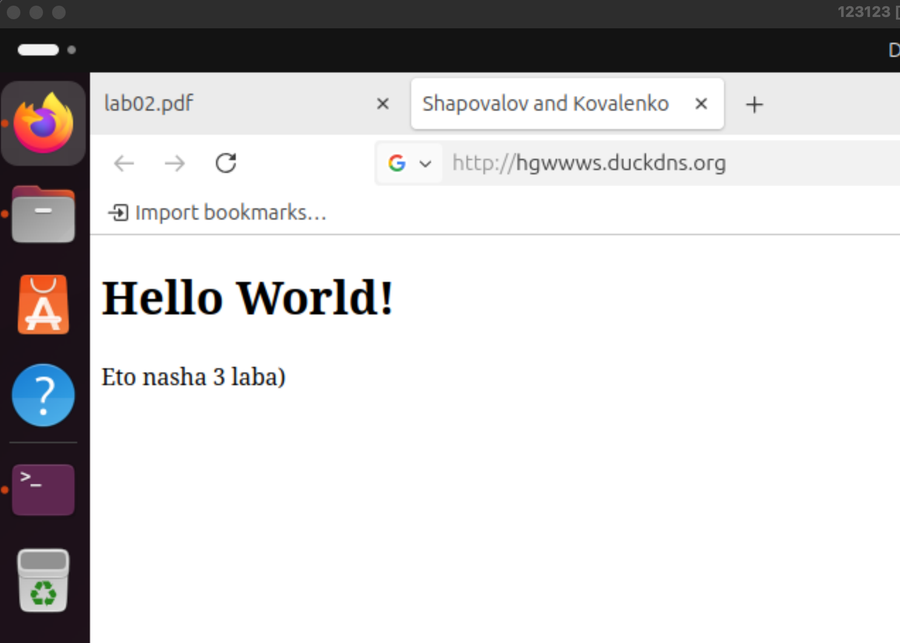

# Отчет по выполнению лаборатной работы #3 - Ansible + Caddy

Выполнили:

1. Шаповалов Сергей К3341
2. Коваленко Евгений К3341

### Перед началом нам было необходим загрузить pip, собсвенно мы идем по гайду и вписываем:

```curl https://bootstrap.pypa.io/ get-pip.py -o get-pip.py && python3 get-pip.py```

### 1. Установка Ansible(ничего сложного идем по гайду):

``` python3 -m pip install ansible```

### Проверяем, что Ansible подлючен к клиенту:



## Задание 1:

### Перед нами стояла задача переписать ad-hoc команды в playbook:

```
---
- name: task1
  hosts: localhost
  gather_facts: false
  tasks:

    - name: Create a text file
      ansible.builtin.copy:
        dest: ~/test.txt
        content: "hello world"

    - name: Show file content before change
      ansible.builtin.shell: cat ~/test.txt
      register: file_before
    - name: Print file content before change
      ansible.builtin.debug:
        msg: "{{ file_before.stdout }}"

    - name: Change file
      ansible.builtin.copy:
        dest: ~/test.txt
        content: "goodbye("

    - name: Show file content after change
      ansible.builtin.shell: cat ~/test.txt
      register: file_after
    - name: Print file content after change
      ansible.builtin.debug:
        msg: "{{ file_after.stdout }}"

    - name: Remove the file
      ansible.builtin.file:
        path: ~/test.txt
        state: absent
```

### Был написан простенький .yml, который создает .txt файл, выводит его содержимое, затем изменяет содержимое и выводит снова, а затем удаляет его вообще




### 2. Установка Caddy:

создаем папку roles и инициализируем Caddy:



### Потом заполняем плейбук по туториалу и проверяем:



### афигеть! apt больше нет....

### Мы прибегнули к помощи ИИ и попросили его переписать yml файл в вид без apt:

```
---
# tasks file for caddy_deploy

- name: Install prerequisites (curl, gpg)
  ansible.builtin.package:
    name:
      - curl
      - gnupg
    state: present

- name: Download Caddy GPG key
  ansible.builtin.get_url:
    url: https://dl.cloudsmith.io/public/caddy/stable/gpg.key
    dest: /usr/share/keyrings/caddy-stable-archive-keyring.gpg

- name: Download the Caddy binary (version 2.6.4)
  ansible.builtin.get_url:
    url: "https://github.com/caddyserver/caddy/releases/download/v2.6.4/caddy_2.6.4_linux_amd64.tar.gz"
    dest: /tmp/caddy.tar.gz

- name: Extract Caddy binary
  ansible.builtin.unarchive:
    src: /tmp/caddy.tar.gz
    dest: /usr/local/bin/
    remote_src: yes
    mode: '0755'

- name: Ensure Caddy binary is executable
  ansible.builtin.file:
    path: /usr/local/bin/caddy
    mode: '0755'
    state: file

- name: Create Caddy systemd service
  ansible.builtin.copy:
    dest: /etc/systemd/system/caddy.service
    content: |
      [Unit]
      Description=Caddy web server
      After=network.target

      [Service]
      ExecStart=/usr/local/bin/caddy run --environ --config /etc/caddy/Caddyfile
      ExecReload=/usr/local/bin/caddy reload --config /etc/caddy/Caddyfile
      Restart=on-failure
      User=root
      Group=root

      [Install]
      WantedBy=multi-user.target
    mode: '0644'

- name: Create Caddy configuration directory
  ansible.builtin.file:
    path: /etc/caddy
    state: directory
    mode: '0755'

- name: Create example Caddyfile
  ansible.builtin.copy:
    dest: /etc/caddy/Caddyfile
    content: |
      :80 {
          respond "Hello, Caddy!"
      }
    mode: '0644'

- name: Reload systemd
  ansible.builtin.systemd:
    daemon_reload: yes

- name: Enable and start Caddy service
  ansible.builtin.systemd:
    name: caddy
    enabled: yes
    state: started

```



### Отлично! Плейбук выполнился без ошибок



KAIF


## Задание 2:

### Стоит задача “Расширить” конфиг вебсервера Caddy c выводом index.html через сервис duckdns.org



### Нами был создан домен на платформе. Далее он был прописан в ```roles/caddy_deploy/vars/main.yml```, а так же был создан файл index.html по пути ```/etc/caddy/Caddyfile/index.html``` с выводом ```Hello World!```

### Проверка ропотоспособности, переходим на наш домен и смотрим вывод:



# WOW получилось

---

### Рефликсия:
#### На самом деле это оказалась нелегкая лабораторная работа, но она нам понравилась, мы изучили много нового и увеличили наши профессиональные знания. Спасибо за лабу!